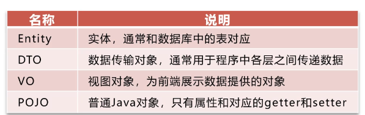
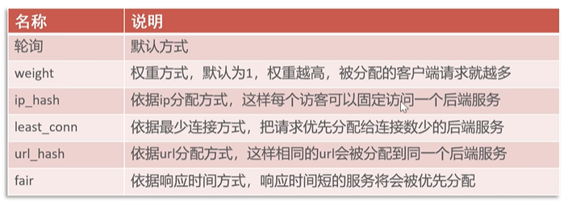
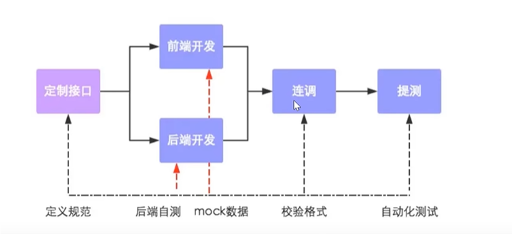

# 苍穹外卖

## 1.前端环境配置

1. 安装nginx
2. 修改nginx.conf

```
#user  www-data;
worker_processes  1;

#error_log  /var/log/nginx/error.log;
#error_log  /var/log/nginx/error.log  notice;
#error_log  /var/log/nginx/error.log  info;

#pid        /var/run/nginx.pid;

events {
    worker_connections  1024;
}

http {
    include       /etc/nginx/mime.types;
    default_type  application/octet-stream;

    #log_format  main  '$remote_addr - $remote_user [$time_local] "$request" '
    #                  '$status $body_bytes_sent "$http_referer" '
    #                  '"$http_user_agent" "$http_x_forwarded_for"';

    #access_log  /var/log/nginx/access.log  main;

    sendfile        on;
    #tcp_nopush     on;

    #keepalive_timeout  0;
    keepalive_timeout  65;

    #gzip  on;

    map $http_upgrade $connection_upgrade {
        default upgrade;
        '' close;
    }

    upstream webservers {
        server 127.0.0.1:8080 weight=90;
        #server 127.0.0.1:8088 weight=10;
    }

    server {
        listen       80;
        server_name  localhost;

        #charset koi8-r;

        #access_log  /var/log/nginx/host.access.log  main;

        location / {
            root   /usr/share/nginx/html/sky;
            index  index.html index.htm;
        }

        #error_page  404              /404.html;

        # redirect server error pages to the static page /50x.html
        error_page   500 502 503 504  /50x.html;
        location = /50x.html {
            root   /usr/share/nginx/html;
        }

        # 反向代理,处理管理端发送的请求
        location /api/ {
            proxy_pass   http://localhost:8080/admin/;
            #proxy_pass   http://webservers/admin/;
        }

        # 反向代理,处理用户端发送的请求
        location /user/ {
            proxy_pass   http://webservers/user/;
        }

        # WebSocket
        location /ws/ {
            proxy_pass   http://webservers/ws/;
            proxy_http_version 1.1;
            proxy_read_timeout 3600s;
            proxy_set_header Upgrade $http_upgrade;
            proxy_set_header Connection "$connection_upgrade";
        }

        # pass the PHP scripts to FastCGI server listening on 127.0.0.1:9000
        #location ~ \.php$ {
        #    root           html;
        #    fastcgi_pass   127.0.0.1:9000;
        #    fastcgi_index  index.php;
        #    fastcgi_param  SCRIPT_FILENAME  /scripts$fastcgi_script_name;
        #    include        fastcgi_params;
        #}

        # deny access to .htaccess files, if Apache's document root
        # concurs with nginx's one
        #location ~ /\.ht {
        #    deny  all;
        #}
    }

    # another virtual host using mix of IP-, name-, and port-based configuration
    #server {
    #    listen       8000;
    #    listen       somename:8080;
    #    server_name  somename  alias  another.alias;

    #    location / {
    #        root   html;
    #        index  index.html index.htm;
    #    }
    #}

    # HTTPS server
    #server {
    #    listen       443 ssl;
    #    server_name  localhost;

    #    ssl_certificate      cert.pem;
    #    ssl_certificate_key  cert.key;

    #    ssl_session_cache    shared:SSL:1m;
    #    ssl_session_timeout  5m;

    #    ssl_ciphers  HIGH:!aNULL:!MD5;
    #    ssl_prefer_server_ciphers  on;

    #    location / {
    #        root   html;
    #        index  index.html index.htm;
    #    }
    #}
}

```


## 2.后端环境

### 1.项目结构

| 名称         | 说明        |
| ------------ | ----------- |
| Sky-take-out | maven父工程 |
| sky-common   | 存放公共类  |
| Sky-poji     | 存放实体类  |
| Sky-server   | 后端服务    |



## 3.数据库

| 序号 | 数据表名      | 中文名称       |
| ---- | ------------- | -------------- |
| 1    | employee      | 员工表         |
| 2    | category      | 分类表         |
| 3    | dish          | 菜品表         |
| 4    | dish_flavor   | 菜品口味表     |
| 5    | setmeal       | 套餐表         |
| 6    | setmeal_dish  | 套餐菜品关系表 |
| 7    | user          | 用户表         |
| 8    | address_book  | 地址表         |
| 9    | shopping_cart | 购物车表       |
| 10   | orders        | 订单表         |
| 11   | order_detail  | 订单明细表     |

### 1. employee

employee表为员工表，用于存储商家内部的员工信息。具体表结构如下：

| 字段名      | 数据类型    | 说明         | 备注        |
| ----------- | ----------- | ------------ | ----------- |
| id          | bigint      | 主键         | 自增        |
| name        | varchar(32) | 姓名         |             |
| username    | varchar(32) | 用户名       | 唯一        |
| password    | varchar(64) | 密码         |             |
| phone       | varchar(11) | 手机号       |             |
| sex         | varchar(2)  | 性别         |             |
| id_number   | varchar(18) | 身份证号     |             |
| status      | int         | 账号状态     | 1正常 0锁定 |
| create_time | datetime    | 创建时间     |             |
| update_time | datetime    | 最后修改时间 |             |
| create_user | bigint      | 创建人id     |             |
| update_user | bigint      | 最后修改人id |             |

### 2. category

category表为分类表，用于存储商品的分类信息。具体表结构如下：

| 字段名      | 数据类型    | 说明         | 备注                 |
| ----------- | ----------- | ------------ | -------------------- |
| id          | bigint      | 主键         | 自增                 |
| name        | varchar(32) | 分类名称     | 唯一                 |
| type        | int         | 分类类型     | 1菜品分类  2套餐分类 |
| sort        | int         | 排序字段     | 用于分类数据的排序   |
| status      | int         | 状态         | 1启用 0禁用          |
| create_time | datetime    | 创建时间     |                      |
| update_time | datetime    | 最后修改时间 |                      |
| create_user | bigint      | 创建人id     |                      |
| update_user | bigint      | 最后修改人id |                      |

### 3. dish

dish表为菜品表，用于存储菜品的信息。具体表结构如下：

| 字段名      | 数据类型      | 说明         | 备注        |
| ----------- | ------------- | ------------ | ----------- |
| id          | bigint        | 主键         | 自增        |
| name        | varchar(32)   | 菜品名称     | 唯一        |
| category_id | bigint        | 分类id       | 逻辑外键    |
| price       | decimal(10,2) | 菜品价格     |             |
| image       | varchar(255)  | 图片路径     |             |
| description | varchar(255)  | 菜品描述     |             |
| status      | int           | 售卖状态     | 1起售 0停售 |
| create_time | datetime      | 创建时间     |             |
| update_time | datetime      | 最后修改时间 |             |
| create_user | bigint        | 创建人id     |             |
| update_user | bigint        | 最后修改人id |             |

### 4. dish_flavor

dish_flavor表为菜品口味表，用于存储菜品的口味信息。具体表结构如下：

| 字段名  | 数据类型     | 说明     | 备注     |
| ------- | ------------ | -------- | -------- |
| id      | bigint       | 主键     | 自增     |
| dish_id | bigint       | 菜品id   | 逻辑外键 |
| name    | varchar(32)  | 口味名称 |          |
| value   | varchar(255) | 口味值   |          |

### 5. setmeal

setmeal表为套餐表，用于存储套餐的信息。具体表结构如下：

| 字段名      | 数据类型      | 说明         | 备注        |
| ----------- | ------------- | ------------ | ----------- |
| id          | bigint        | 主键         | 自增        |
| name        | varchar(32)   | 套餐名称     | 唯一        |
| category_id | bigint        | 分类id       | 逻辑外键    |
| price       | decimal(10,2) | 套餐价格     |             |
| image       | varchar(255)  | 图片路径     |             |
| description | varchar(255)  | 套餐描述     |             |
| status      | int           | 售卖状态     | 1起售 0停售 |
| create_time | datetime      | 创建时间     |             |
| update_time | datetime      | 最后修改时间 |             |
| create_user | bigint        | 创建人id     |             |
| update_user | bigint        | 最后修改人id |             |

### 6. setmeal_dish

setmeal_dish表为套餐菜品关系表，用于存储套餐和菜品的关联关系。具体表结构如下：

| 字段名     | 数据类型      | 说明     | 备注     |
| ---------- | ------------- | -------- | -------- |
| id         | bigint        | 主键     | 自增     |
| setmeal_id | bigint        | 套餐id   | 逻辑外键 |
| dish_id    | bigint        | 菜品id   | 逻辑外键 |
| name       | varchar(32)   | 菜品名称 | 冗余字段 |
| price      | decimal(10,2) | 菜品单价 | 冗余字段 |
| copies     | int           | 菜品份数 |          |

### 7. user

user表为用户表，用于存储C端用户的信息。具体表结构如下：

| 字段名      | 数据类型     | 说明               | 备注 |
| ----------- | ------------ | ------------------ | ---- |
| id          | bigint       | 主键               | 自增 |
| openid      | varchar(45)  | 微信用户的唯一标识 |      |
| name        | varchar(32)  | 用户姓名           |      |
| phone       | varchar(11)  | 手机号             |      |
| sex         | varchar(2)   | 性别               |      |
| id_number   | varchar(18)  | 身份证号           |      |
| avatar      | varchar(500) | 微信用户头像路径   |      |
| create_time | datetime     | 注册时间           |      |

### 8. address_book

address_book表为地址表，用于存储C端用户的收货地址信息。具体表结构如下：

| 字段名        | 数据类型     | 说明         | 备注           |
| ------------- | ------------ | ------------ | -------------- |
| id            | bigint       | 主键         | 自增           |
| user_id       | bigint       | 用户id       | 逻辑外键       |
| consignee     | varchar(50)  | 收货人       |                |
| sex           | varchar(2)   | 性别         |                |
| phone         | varchar(11)  | 手机号       |                |
| province_code | varchar(12)  | 省份编码     |                |
| province_name | varchar(32)  | 省份名称     |                |
| city_code     | varchar(12)  | 城市编码     |                |
| city_name     | varchar(32)  | 城市名称     |                |
| district_code | varchar(12)  | 区县编码     |                |
| district_name | varchar(32)  | 区县名称     |                |
| detail        | varchar(200) | 详细地址信息 | 具体到门牌号   |
| label         | varchar(100) | 标签         | 公司、家、学校 |
| is_default    | tinyint(1)   | 是否默认地址 | 1是 0否        |

### 9. shopping_cart

shopping_cart表为购物车表，用于存储C端用户的购物车信息。具体表结构如下：

| 字段名      | 数据类型      | 说明         | 备注     |
| ----------- | ------------- | ------------ | -------- |
| id          | bigint        | 主键         | 自增     |
| name        | varchar(32)   | 商品名称     |          |
| image       | varchar(255)  | 商品图片路径 |          |
| user_id     | bigint        | 用户id       | 逻辑外键 |
| dish_id     | bigint        | 菜品id       | 逻辑外键 |
| setmeal_id  | bigint        | 套餐id       | 逻辑外键 |
| dish_flavor | varchar(50)   | 菜品口味     |          |
| number      | int           | 商品数量     |          |
| amount      | decimal(10,2) | 商品单价     |          |
| create_time | datetime      | 创建时间     |          |

### 10. orders

orders表为订单表，用于存储C端用户的订单数据。具体表结构如下：

| 字段名                  | 数据类型      | 说明         | 备注                                            |
| ----------------------- | ------------- | ------------ | ----------------------------------------------- |
| id                      | bigint        | 主键         | 自增                                            |
| number                  | varchar(50)   | 订单号       |                                                 |
| status                  | int           | 订单状态     | 1待付款 2待接单 3已接单 4派送中 5已完成 6已取消 |
| user_id                 | bigint        | 用户id       | 逻辑外键                                        |
| address_book_id         | bigint        | 地址id       | 逻辑外键                                        |
| order_time              | datetime      | 下单时间     |                                                 |
| checkout_time           | datetime      | 付款时间     |                                                 |
| pay_method              | int           | 支付方式     | 1微信支付 2支付宝支付                           |
| pay_status              | tinyint       | 支付状态     | 0未支付 1已支付 2退款                           |
| amount                  | decimal(10,2) | 订单金额     |                                                 |
| remark                  | varchar(100)  | 备注信息     |                                                 |
| phone                   | varchar(11)   | 手机号       |                                                 |
| address                 | varchar(255)  | 详细地址信息 |                                                 |
| user_name               | varchar(32)   | 用户姓名     |                                                 |
| consignee               | varchar(32)   | 收货人       |                                                 |
| cancel_reason           | varchar(255)  | 订单取消原因 |                                                 |
| rejection_reason        | varchar(255)  | 拒单原因     |                                                 |
| cancel_time             | datetime      | 订单取消时间 |                                                 |
| estimated_delivery_time | datetime      | 预计送达时间 |                                                 |
| delivery_status         | tinyint       | 配送状态     | 1立即送出  0选择具体时间                        |
| delivery_time           | datetime      | 送达时间     |                                                 |
| pack_amount             | int           | 打包费       |                                                 |
| tableware_number        | int           | 餐具数量     |                                                 |
| tableware_status        | tinyint       | 餐具数量状态 | 1按餐量提供  0选择具体数量                      |

### 11. order_detail

order_detail表为订单明细表，用于存储C端用户的订单明细数据。具体表结构如下：

| 字段名      | 数据类型      | 说明         | 备注     |
| ----------- | ------------- | ------------ | -------- |
| id          | bigint        | 主键         | 自增     |
| name        | varchar(32)   | 商品名称     |          |
| image       | varchar(255)  | 商品图片路径 |          |
| order_id    | bigint        | 订单id       | 逻辑外键 |
| dish_id     | bigint        | 菜品id       | 逻辑外键 |
| setmeal_id  | bigint        | 套餐id       | 逻辑外键 |
| dish_flavor | varchar(50)   | 菜品口味     |          |
| number      | int           | 商品数量     |          |
| amount      | decimal(10,2) | 商品单价     |          |

## 4.nginx

nginx反向代理

### 优点

- 提高访问速度
- 进行负载均衡
- 保证后端服务安全

### 配置

反向代理

```
server {
    listen 80;
    server_name localhost;

    location /api/ {
        proxy_pass http://localhost:8080/admin/; #反向代理
    }
}
```


负载均衡

```
upstream webservers {
    server 192.168.100.128:8080;
    server 192.168.100.129:8080;
}

server {
    listen 80;
    server_name localhost;

    location /api/ {
        proxy_pass http://webservers/admin/; #负载均衡
    }
}
```

### nginx负载均衡策略：



## 5.登陆

### MD5加密

提高安全性，单向加密，只能比对

```
//进行md5加密，然后再进行比对
password = DigestUtils.md5DigestAsHex(password.getBytes());
if (!password.equals(employee.getPassword())) {
    //密码错误
    throw new PasswordErrorException(MessageConstant.PASSWORD_ERROR);
}
```

## 6.接口

### 前后端开发流程



### Swagger 

Knife4j

```
<dependency>
    <groupId>com.github.xiaoymin</groupId>
    <artifactId>knife4j-spring-boot-starter</artifactId>
    <version>3.0.2</version>
</dependency>
```

1. 导入maven坐标
2. 配置类加入Knife4j配置
3. 设置静态资源映射

```
@Bean
public Docket docket() {
    ApiInfo apiInfo = new ApiInfoBuilder()
        .title("苍穹外卖项目接口文档")
        .version("2.0")
        .description("苍穹外卖项目接口文档")
        .build();

    Docket docket = new Docket(DocumentationType.SWAGGER_2)
        .apiInfo(apiInfo)
        .select()
        .apis(RequestHandlerSelectors.basePackage("com.sky.controller"))
        .paths(PathSelectors.any())
        .build();

    return docket;
}
```

```
/**
 * 设置信息静态资源映射
 * @param registry
 */
protected void addResourceHandlers(ResourceHandlerRegistry registry) {
    log.info("开始设置信息静态资源映射...");
    registry.addResourceHandler("/doc.html").addResourceLocations("classpath:/META-INF/resources/");
    registry.addResourceHandler("/webjars/**").addResourceLocations("classpath:/META-INF/resources/webjars/");
}

```

常用注解

| 注解              | 说明                        |
| ----------------- | --------------------------- |
| @Api              | 用在类上，例如Controller    |
| @ApiModel         | 用在类上，例如entity,DTO,VO |
| @ApiModelProperty | 用在属性上，描述属性信息    |
| @ApiOperation     | 用在方法上，例如Controller  |

## 7.新增员工

